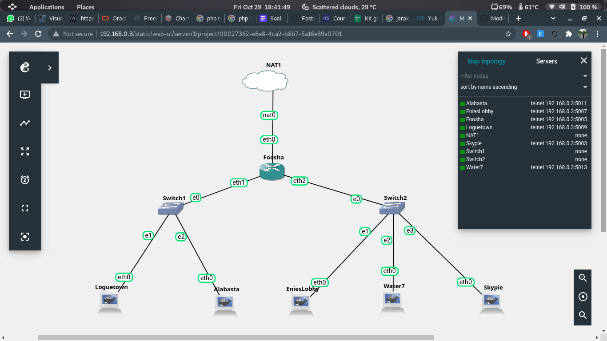
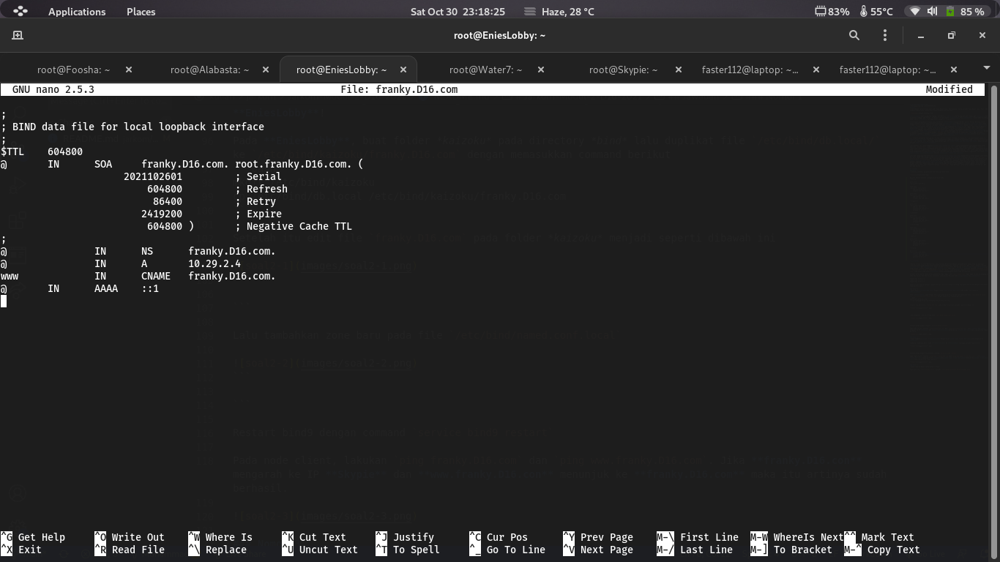
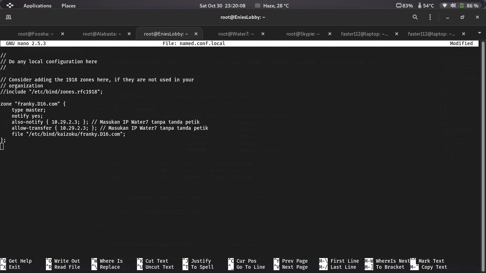
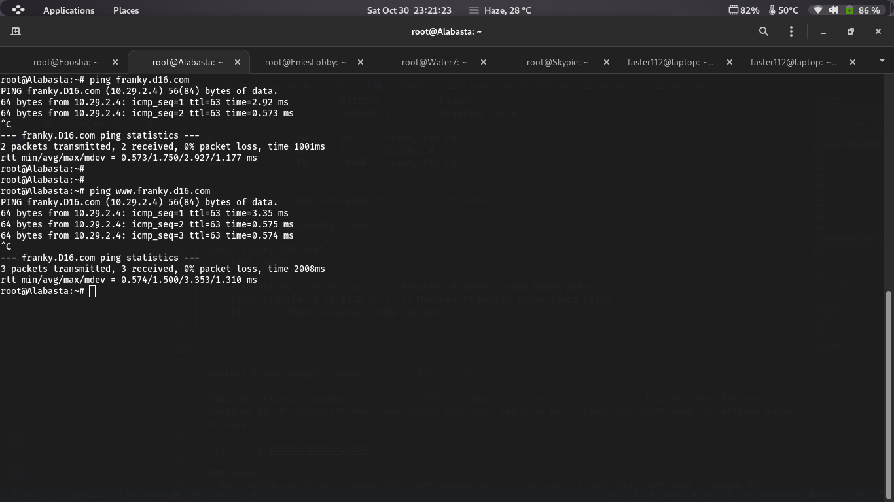
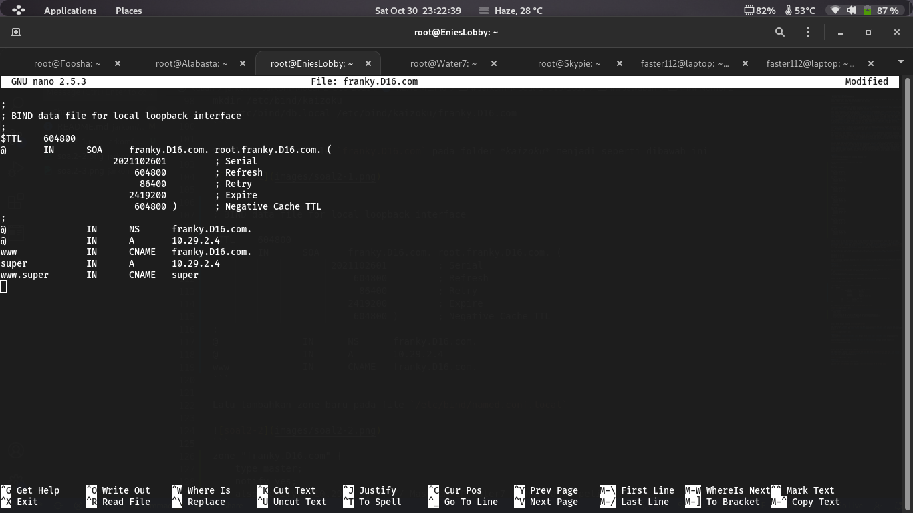
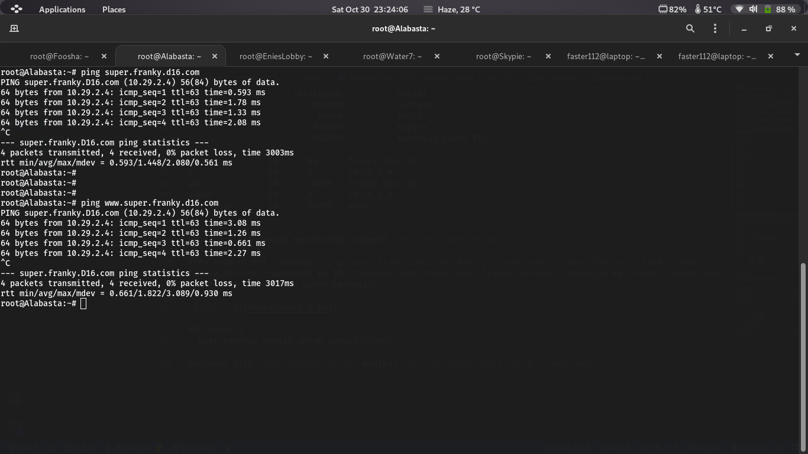

# Jarkom-Modul-2-D16-2021
## Soal
Luffy adalah seorang yang akan jadi Raja Bajak Laut. Demi membuat Luffy menjadi Raja Bajak Laut, Nami ingin membuat sebuah peta, bantu Nami untuk membuat peta berikut:


**EniesLobby** akan dijadikan sebagai DNS Master, **Water7** akan dijadikan DNS Slave, dan **Skypie** akan digunakan sebagai Web Server. Terdapat 2 Client yaitu **Loguetown**, dan **Alabasta**. Semua node terhubung pada router **Foosha**, sehingga dapat mengakses internet (1). 

Luffy ingin menghubungi Franky yang berada di **EniesLobby** dengan denden mushi. Kalian diminta Luffy untuk membuat website utama dengan mengakses **franky.yyy.com** dengan alias **www.franky.yyy.com** pada folder `kaizoku` (2). Setelah itu buat subdomain **super.franky.yyy.com** dengan alias **www.super.franky.yyy.com** yang diatur DNS nya di **EniesLobby** dan mengarah ke **Skypie**(3). Buat juga reverse domain untuk domain utama (4). Supaya tetap bisa menghubungi Franky jika server EniesLobby rusak, maka buat **Water7** sebagai DNS Slave untuk domain utama (5). Setelah itu terdapat subdomain **mecha.franky.yyy.com** dengan alias **www.mecha.franky.yyy.com** yang didelegasikan dari **EniesLobby** ke **Water7** dengan IP menuju ke **Skypie** dalam folder `sunnygo`(6). Untuk memperlancar komunikasi Luffy dan rekannya, dibuatkan subdomain melalui **Water7** dengan nama **general.mecha.franky.yyy.com** dengan alias **www.general.mecha.franky.yyy.com** yang mengarah ke **Skypie**(7). 

(8) Setelah melakukan konfigurasi server, maka dilakukan konfigurasi Webserver. Pertama dengan webserver **www.franky.yyy.com**. Pertama, luffy membutuhkan webserver dengan DocumentRoot pada `/var/www/franky.yyy.com`. (9) Setelah itu, Luffy juga membutuhkan agar url **www.franky.yyy.com/index.php/home** dapat menjadi menjadi **www.franky.yyy.com/home**. 

(10) Setelah itu, pada subdomain **www.super.franky.yyy.com**, Luffy membutuhkan penyimpanan aset yang memiliki `DocumentRoot` pada `/var/www/super.franky.yyy.com` .(11) Akan tetapi, pada folder `/public`, Luffy ingin hanya dapat melakukan directory listing saja.(12) Tidak hanya itu, Luffy juga menyiapkan error file `404.html` pada folder `/error` untuk mengganti error kode pada apache . (13) Luffy juga meminta Nami untuk dibuatkan konfigurasi virtual host. Virtual host ini bertujuan untuk dapat mengakses file asset **www.super.franky.yyy.com/public/js** menjadi **www.super.franky.yyy.com/js**. 

(14) Dan Luffy meminta untuk web **www.general.mecha.franky.yyy.com** hanya bisa diakses dengan port 15000 dan port 15500 (15) dengan autentikasi username *luffy* dan password *onepiece* dan file di `/var/www/general.mecha.franky.yyy` (16)  Dan setiap kali mengakses IP **Skypie** akan dialihkan secara otomatis ke **www.franky.yyy.com** (17). Dikarenakan Franky juga ingin mengajak temannya untuk dapat menghubunginya melalui website **www.super.franky.yyy.com**, dan dikarenakan pengunjung web server pasti akan bingung dengan randomnya images yang ada, maka Franky juga meminta untuk mengganti request gambar yang memiliki substring “franky” akan diarahkan menuju `franky.png`. Maka bantulah Luffy untuk membuat konfigurasi dns dan web server ini!

## Jawaban
### Nomor 1
* Buatlah topologi berdasarkan apa yang ada pada soal!



* **CATATAN**

Sebelum lanjut ke soal berikutnya, yang pertama dilakukan adalah menyambungkan semua node ke jaringan internet untuk menginstall semua software yang dibutuhkan, seperti `dnsutils` dan  `lynx` untuk 2 Client (**Loguetown** dan **Alabasta**) lalu install `bind9` untuk DNS Server (**EniesLobby** dan **Water7**) dan menginstall `apache` untuk Web Server (**Skypie**). Pada node **Foosha**, masukkan command `iptables -t nat -A POSTROUTING -o eth0 -j MASQUERADE -s 10.29.0.0/16`, lalu masukkan command `echo nameserver > /etc/resolv.conf` pada semua node selain **Foosha** untuk menyambungkan semua node ke internet.

Setelah menginstall semua yang diperlukan, edit lagi file `/etc/resolv.conf` agar node client tersambung ke node DNS Server dan Web Server. Masukkan configurasi berikut pada **Loguetown** dan **Alabasta**
```
nameserver 10.29.2.2
nameserver 10.29.2.3
nameserver 10.29.2.4
```

### Nomor 2
* Buat domain **franky.D16.com** dengan alias **www.franky.D16.com** pada folder *kaizoku* di **EniesLobby**!

Pada **EniesLobby**, buat folder *kaizoku* pada directory *bind* lalu duplikat file `/etc/bind/db.local/` ke `/etc/bind/kaizoku/franky.D16.com` dengan memasukkan command berikut
```bash
mkdir /etc/bind/kaizoku
cp /etc/bind/db.local /etc/bind/kaizoku/franky.D16.com
```

Setelah itu edit file `franky.D16.com` pada folder *kaizoku* menjadi seperti dibawah ini


```

```

Lalu tambahkan zone baru pada file `/etc/bind/named.conf.local`


```

```

Restart bind9 dengan command `service bind9 restart`

Pada node client, lakukan `ping franky.D16.com` dan `ping www.franky.D16.com`. Jika **franky.D16.con** mengarah ke IP **Skypie** dan **www.franky.D16.con** menunjuk ke **franky.D16.com** maka itu artinya sudah berhasil.



### Nomor 3
* Buat subdomain **super.franky.D16.com** dengan alias **www.super.franky.D16.com** yang mengarah ke **Skypie**!

Tambahkan beberapa baris pada **franky.D16.con** di **EniesLobby** sehingga menjadi seperti ini


```

```

Restart bind9 dengan menjalankan command `service bind9 restart`

Pada node client, lakukan `ping super.franky.D16.com` dan `ping www.super.franky.D16.com`. Jika **super.franky.D16.con** mengarah ke IP **Skypie** dan **www.super.franky.D16.con** menunjuk ke **super.franky.D16.com** maka itu artinya sudah berhasil.



### Nomor 4
* Buat reverse domain untuk domain utama!

Duplikat file `/etc/bind/db.local` menjadi `/etc/bind/kaizoku/2.29.10.in-addr.arpa`
