# Jarkom-Modul-2-D16-2021
* Mohammad Tauchid (05111940000136)
## Soal
Luffy adalah seorang yang akan jadi Raja Bajak Laut. Demi membuat Luffy menjadi Raja Bajak Laut, Nami ingin membuat sebuah peta, bantu Nami untuk membuat peta berikut:


**EniesLobby** akan dijadikan sebagai DNS Master, **Water7** akan dijadikan DNS Slave, dan **Skypie** akan digunakan sebagai Web Server. Terdapat 2 Client yaitu **Loguetown**, dan **Alabasta**. Semua node terhubung pada router **Foosha**, sehingga dapat mengakses internet (1). 

Luffy ingin menghubungi Franky yang berada di **EniesLobby** dengan denden mushi. Kalian diminta Luffy untuk membuat website utama dengan mengakses **franky.yyy.com** dengan alias **www.franky.yyy.com** pada folder `kaizoku` (2). Setelah itu buat subdomain **super.franky.yyy.com** dengan alias **www.super.franky.yyy.com** yang diatur DNS nya di **EniesLobby** dan mengarah ke **Skypie**(3). Buat juga reverse domain untuk domain utama (4). Supaya tetap bisa menghubungi Franky jika server EniesLobby rusak, maka buat **Water7** sebagai DNS Slave untuk domain utama (5). Setelah itu terdapat subdomain **mecha.franky.yyy.com** dengan alias **www.mecha.franky.yyy.com** yang didelegasikan dari **EniesLobby** ke **Water7** dengan IP menuju ke **Skypie** dalam folder `sunnygo`(6). Untuk memperlancar komunikasi Luffy dan rekannya, dibuatkan subdomain melalui **Water7** dengan nama **general.mecha.franky.yyy.com** dengan alias **www.general.mecha.franky.yyy.com** yang mengarah ke **Skypie**(7). 

(8) Setelah melakukan konfigurasi server, maka dilakukan konfigurasi Webserver. Pertama dengan webserver **www.franky.yyy.com**. Pertama, luffy membutuhkan webserver dengan DocumentRoot pada `/var/www/franky.yyy.com`. (9) Setelah itu, Luffy juga membutuhkan agar url **www.franky.yyy.com/index.php/home** dapat menjadi menjadi **www.franky.yyy.com/home**. 

(10) Setelah itu, pada subdomain **www.super.franky.yyy.com**, Luffy membutuhkan penyimpanan aset yang memiliki `DocumentRoot` pada `/var/www/super.franky.yyy.com` .(11) Akan tetapi, pada folder `/public`, Luffy ingin hanya dapat melakukan directory listing saja.(12) Tidak hanya itu, Luffy juga menyiapkan error file `404.html` pada folder `/error` untuk mengganti error kode pada apache . (13) Luffy juga meminta Nami untuk dibuatkan konfigurasi virtual host. Virtual host ini bertujuan untuk dapat mengakses file asset **www.super.franky.yyy.com/public/js** menjadi **www.super.franky.yyy.com/js**. 

(14) Dan Luffy meminta untuk web **www.general.mecha.franky.yyy.com** hanya bisa diakses dengan port 15000 dan port 15500 (15) dengan autentikasi username *luffy* dan password *onepiece* dan file di `/var/www/general.mecha.franky.yyy` (16)  Dan setiap kali mengakses IP **Skypie** akan dialihkan secara otomatis ke **www.franky.yyy.com** (17). Dikarenakan Franky juga ingin mengajak temannya untuk dapat menghubunginya melalui website **www.super.franky.yyy.com**, dan dikarenakan pengunjung web server pasti akan bingung dengan randomnya images yang ada, maka Franky juga meminta untuk mengganti request gambar yang memiliki substring “franky” akan diarahkan menuju `franky.png`. Maka bantulah Luffy untuk membuat konfigurasi dns dan web server ini!

## Jawaban
### Nomor 1
* Buatlah topologi berdasarkan apa yang ada pada soal!


Berikut adalah network configuration tiap node
* Foosha
```
auto eth0
iface eth0 inet dhcp

auto eth1
iface eth1 inet static
	address 10.29.1.1
	netmask 255.255.255.0

auto eth2
iface eth2 inet static
	address 10.29.2.1
	netmask 255.255.255.0
```
* Loguetown
```
auto eth0
iface eth0 inet static
	address 10.29.1.2
	netmask 255.255.255.0
	gateway 10.29.1.1
```
* Alabasta
```
auto eth0
iface eth0 inet static
	address 10.29.1.3
	netmask 255.255.255.0
	gateway 10.29.1.1
```
* EniesLobby
```
auto eth0
iface eth0 inet static
	address 10.29.2.2
	netmask 255.255.255.0
	gateway 10.29.2.1
```
* Water7
```
auto eth0
iface eth0 inet static
	address 10.29.2.3
	netmask 255.255.255.0
	gateway 10.29.2.1
```
* Skypie
```
auto eth0
iface eth0 inet static
	address 10.29.2.4
	netmask 255.255.255.0
	gateway 10.29.2.1
```

* **CATATAN**

Sebelum lanjut ke soal berikutnya, yang pertama dilakukan adalah menyambungkan semua node ke jaringan internet untuk menginstall semua software yang dibutuhkan, seperti `dnsutils` dan  `lynx` untuk 2 Client (**Loguetown** dan **Alabasta**) lalu install `bind9` untuk DNS Server (**EniesLobby** dan **Water7**) dan menginstall `apache` untuk Web Server (**Skypie**). Pada node **Foosha**, masukkan command `iptables -t nat -A POSTROUTING -o eth0 -j MASQUERADE -s 10.29.0.0/16`, lalu masukkan command `echo nameserver > /etc/resolv.conf` pada semua node selain **Foosha** untuk menyambungkan semua node ke internet.

Setelah menginstall semua yang diperlukan, edit lagi file `/etc/resolv.conf` agar node client tersambung ke node DNS Server dan Web Server. Masukkan configurasi berikut pada **Loguetown** dan **Alabasta**
```
nameserver 10.29.2.2
nameserver 10.29.2.3
nameserver 10.29.2.4
```
Semua script yang digunakan, dapat dilihat [di sini](https://github.com/Faster112/Jarkom-Modul-2-D16-2021/tree/main/scripts)

### Nomor 2
* Buat domain **franky.D16.com** dengan alias **www.franky.D16.com** pada folder *kaizoku* di **EniesLobby**!

Pada **EniesLobby**, buat folder *kaizoku* pada directory *bind* lalu duplikat file `/etc/bind/db.local/` ke `/etc/bind/kaizoku/franky.D16.com` dengan memasukkan command berikut
```bash
mkdir /etc/bind/kaizoku
cp /etc/bind/db.local /etc/bind/kaizoku/franky.D16.com
```

Setelah itu edit file `franky.D16.com` pada folder *kaizoku* menjadi seperti dibawah ini


```
;
; BIND data file for local loopback interface
;
$TTL    604800
@       IN      SOA     franky.D16.com. root.franky.D16.com. (
                     2021102601         ; Serial
                         604800         ; Refresh
                          86400         ; Retry
                        2419200         ; Expire
                         604800 )       ; Negative Cache TTL
;
@               IN      NS      franky.D16.com.
@               IN      A       10.29.2.4
www             IN      CNAME   franky.D16.com.
```

Lalu tambahkan zone baru pada file `/etc/bind/named.conf.local`


```
zone "franky.D16.com" {
    type master;
    notify yes;
    also-notify { 10.29.2.3; }; // Masukan IP Water7 tanpa tanda petik
    allow-transfer { 10.29.2.3; }; // Masukan IP Water7 tanpa tanda petik
    file "/etc/bind/kaizoku/franky.D16.com";
};

```

Restart bind9 dengan command `service bind9 restart`

Pada node client, lakukan `ping franky.D16.com` dan `ping www.franky.D16.com`. Jika **franky.D16.con** mengarah ke IP **Skypie** dan **www.franky.D16.con** menunjuk ke **franky.D16.com** maka itu artinya sudah berhasil.


### Nomor 3
* Buat subdomain **super.franky.D16.com** dengan alias **www.super.franky.D16.com** yang mengarah ke **Skypie**!

Tambahkan beberapa baris pada **franky.D16.con** di **EniesLobby** sehingga menjadi seperti ini


```
;
; BIND data file for local loopback interface
;
$TTL    604800
@       IN      SOA     franky.D16.com. root.franky.D16.com. (
                     2021102601         ; Serial
                         604800         ; Refresh
                          86400         ; Retry
                        2419200         ; Expire
                         604800 )       ; Negative Cache TTL
;
@               IN      NS      franky.D16.com.
@               IN      A       10.29.2.4
www             IN      CNAME   franky.D16.com.
super           IN      A       10.29.2.4
www.super       IN      CNAME   super
```

Restart bind9 dengan menjalankan command `service bind9 restart`

Pada node client, lakukan `ping super.franky.D16.com` dan `ping www.super.franky.D16.com`. Jika **super.franky.D16.con** mengarah ke IP **Skypie** dan **www.super.franky.D16.con** menunjuk ke **super.franky.D16.com** maka itu artinya sudah berhasil.


### Nomor 4
* Buat reverse domain untuk domain utama!

Duplikat file `/etc/bind/db.local` menjadi `/etc/bind/kaizoku/2.29.10.in-addr.arpa`. Lalu ubah isi file `2.29.10.in-addr.arpa` menjadi seperti ini

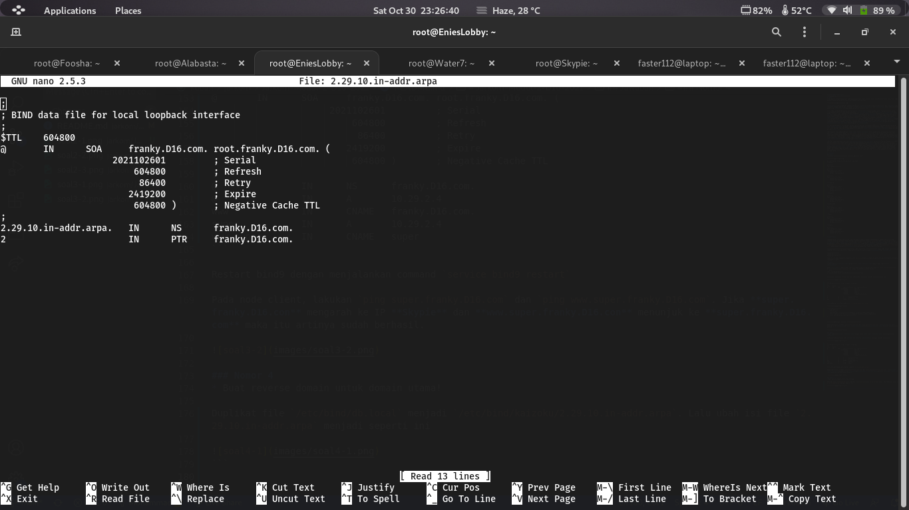
```
;
; BIND data file for local loopback interface
;
$TTL    604800
@       IN      SOA     franky.D16.com. root.franky.D16.com. (
                     2021102601         ; Serial
                         604800         ; Refresh
                          86400         ; Retry
                        2419200         ; Expire
                         604800 )       ; Negative Cache TTL
;
2.29.10.in-addr.arpa.   IN      NS      franky.D16.com.
2                       IN      PTR     franky.D16.com.
```

Lalu tambahkan zone baru pada file `/etc/bind/named.conf.local` sehingga menjadi seperti ini

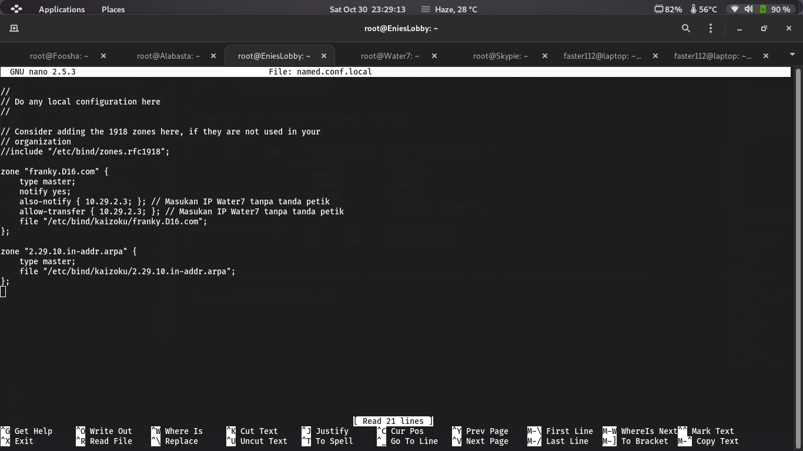
```
zone "2.29.10.in-addr.arpa" {
    type master;
    file "/etc/bind/kaizoku/2.29.10.in-addr.arpa";
};
```

Restart bind9 dengan menjalankan command `service bind9 restart`

Kemudian cek dengan command `host -t PTR [IP EniesLobby]` pada client

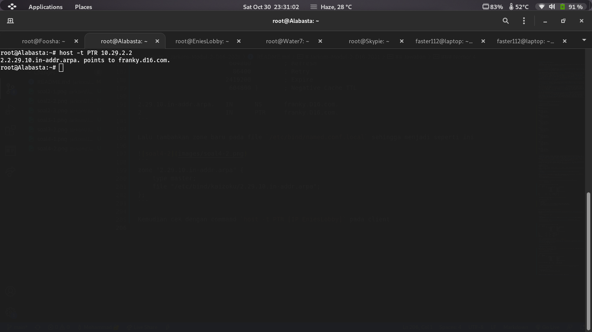

### Nomor 5
* Buat Water7 sebagai DNS Slave untuk domain utama!

Sebelumnya, isi file `/etc/bind/named.conf.local` pada **EniesLobby** telah dikonfigurasi pada Soal Nomor 1 sehingga tidak perlu diedit lagi. Yang perlu diedit adalah file `/etc/bind/named.conf.options` dengan meng-comment `dnssec-validation auto;` dan menambahkan `allow-query { any; };` pada **EniesLobby** dan **Water7**.

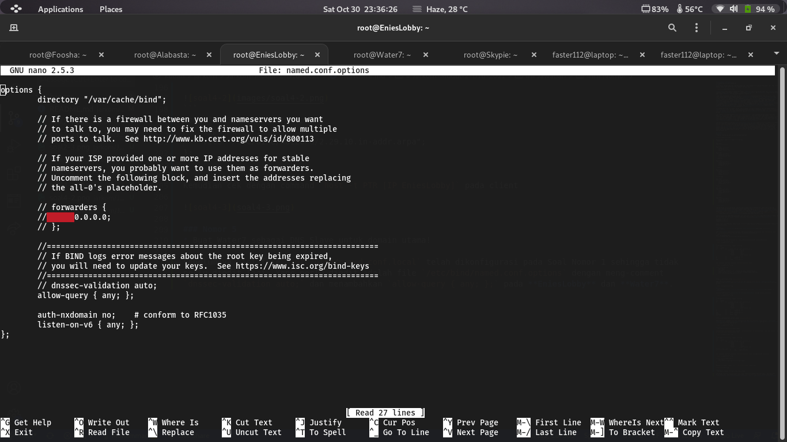
```
options {
        directory "/var/cache/bind";

        // If there is a firewall between you and nameservers you want
        // to talk to, you may need to fix the firewall to allow multiple
        // ports to talk.  See http://www.kb.cert.org/vuls/id/800113

        // If your ISP provided one or more IP addresses for stable
        // nameservers, you probably want to use them as forwarders.
        // Uncomment the following block, and insert the addresses replacing
        // the all-0's placeholder.

        // forwarders {
        //      0.0.0.0;
        // };

        //========================================================================
        // If BIND logs error messages about the root key being expired,
        // you will need to update your keys.  See https://www.isc.org/bind-keys
        //========================================================================
        // dnssec-validation auto;
        allow-query { any; };

        auth-nxdomain no;    # conform to RFC1035
        listen-on-v6 { any; };
};
```

Kemudian edit file `/etc/bind/named.conf.local` di **Water7** menjadi seperti ini

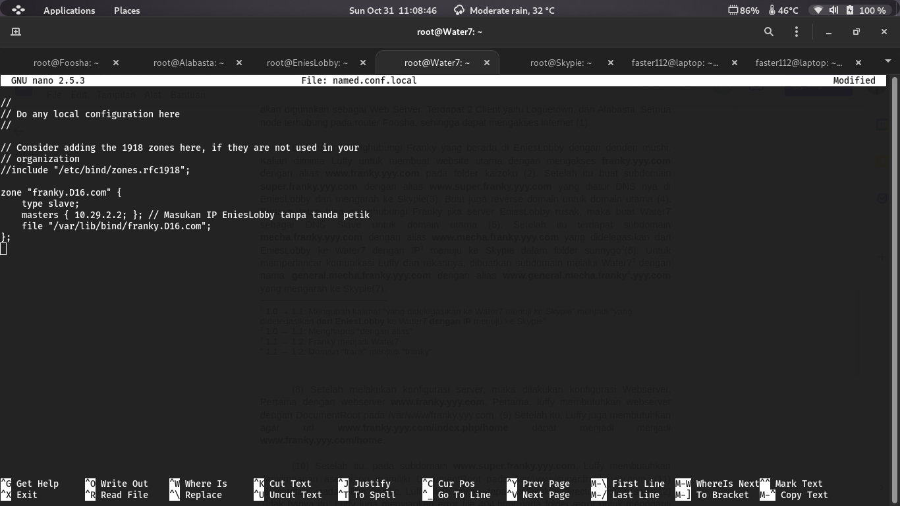
```
//
// Do any local configuration here
//

// Consider adding the 1918 zones here, if they are not used in your
// organization
//include "/etc/bind/zones.rfc1918";

zone "franky.D16.com" {
    type slave;
    masters { 10.29.2.2; }; // Masukan IP EniesLobby tanpa tanda petik
    file "/var/lib/bind/franky.D16.com";
};
```

Restart bind9 dengan menjalankan command `service bind9 restart`

Setelah itu stop service bind di **EniesLobby** dengan command `service bind9 stop` dan lakukan `ping franky.D16.com` pada client untuk mengecek apakah DNS Slave sudah dapat bekerja

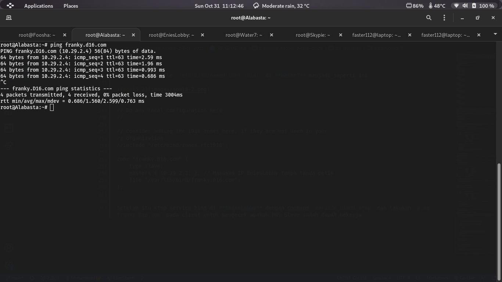

### Nomor 6
* Delegasikan subdomain **mecha.franky.yyy.com** dengan alias **www.mecha.franky.yyy.com** dari **EniesLobby** ke **Water7** dengan IP menuju ke **Skypie** dalam folder *sunnygo*!

Edit file `/etc/bind/kaizoku/franky.D16.com` menjadi seperti ini

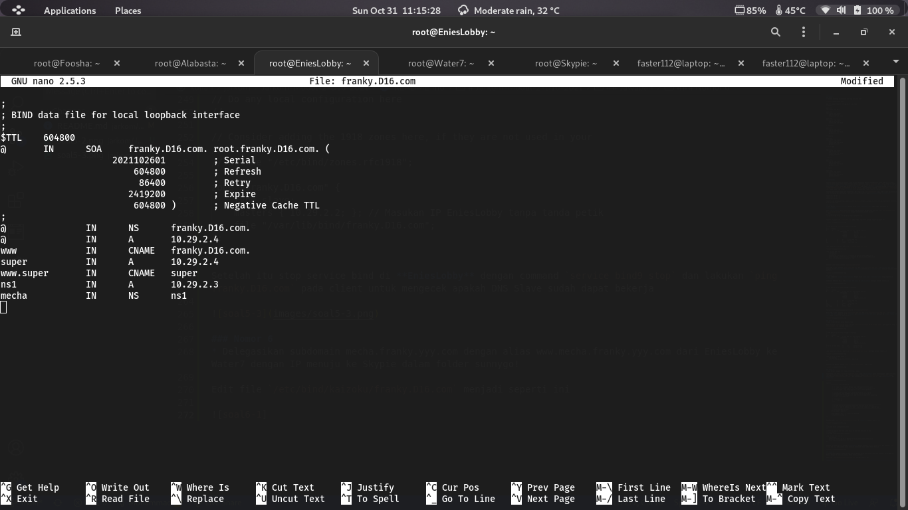
```
;
; BIND data file for local loopback interface
;
$TTL    604800
@       IN      SOA     franky.D16.com. root.franky.D16.com. (
                     2021102601         ; Serial
                         604800         ; Refresh
                          86400         ; Retry
                        2419200         ; Expire
                         604800 )       ; Negative Cache TTL
;
@               IN      NS      franky.D16.com.
@               IN      A       10.29.2.4
www             IN      CNAME   franky.D16.com.
super           IN      A       10.29.2.4
www.super       IN      CNAME   super
ns1             IN      A       10.29.2.3
mecha           IN      NS      ns1
```

Lalu restart bind9 dengan menjalankan command `service bind9 restart`

Pada **Water7** buat folder baru bernama *sunnygo* lalu duplikasi file `/etc/bind/db.local` ke `/etc/bind/sunnygo/mecha.franky.D16.com`
```bash
mkdir /etc/bind/sunnygo
cp /etc/bind/db.local /etc/bind/sunnygo/mecha.franky.D16.com
```

Kemudian edit file `mecha.franky.D16.com` menjadi seperti ini

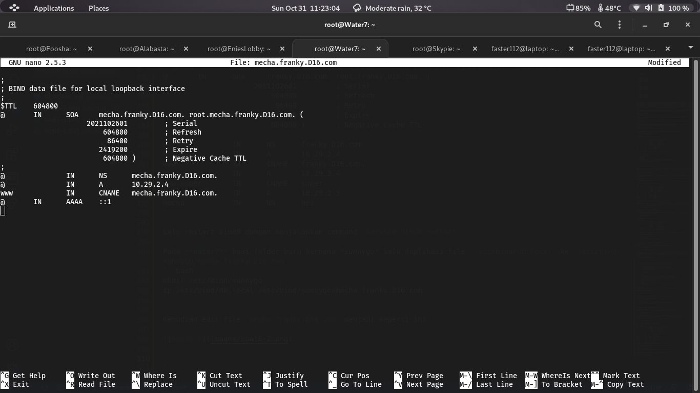
```
;
; BIND data file for local loopback interface
;
$TTL    604800
@       IN      SOA     mecha.franky.D16.com. root.mecha.franky.D16.com. (
                     2021102601         ; Serial
                         604800         ; Refresh
                          86400         ; Retry
                        2419200         ; Expire
                         604800 )       ; Negative Cache TTL
;
@               IN      NS      mecha.franky.D16.com.
@               IN      A       10.29.2.4
www             IN      CNAME   mecha.franky.D16.com.
```

Selanjutnya, tambahkan zone baru pada `/etc/bind/named.conf.local` sehingga menjadi seperti ini


```
//
// Do any local configuration here
//

// Consider adding the 1918 zones here, if they are not used in your
// organization
//include "/etc/bind/zones.rfc1918";

zone "franky.D16.com" {
    type slave;
    masters { 10.29.2.2; }; // Masukan IP EniesLobby tanpa tanda petik
    file "/var/lib/bind/franky.D16.com";
};

zone "mecha.franky.D16.com" {
    type master;
    file "/etc/bind/sunnygo/mecha.franky.D16.com";
};
```

Restart bind menggunakan command `service bind9 restart`

Pada client, lakukan `ping mecha.franky.D16.com` atau `www.mecha.franky.D16.com` untuk melihat hasilnya

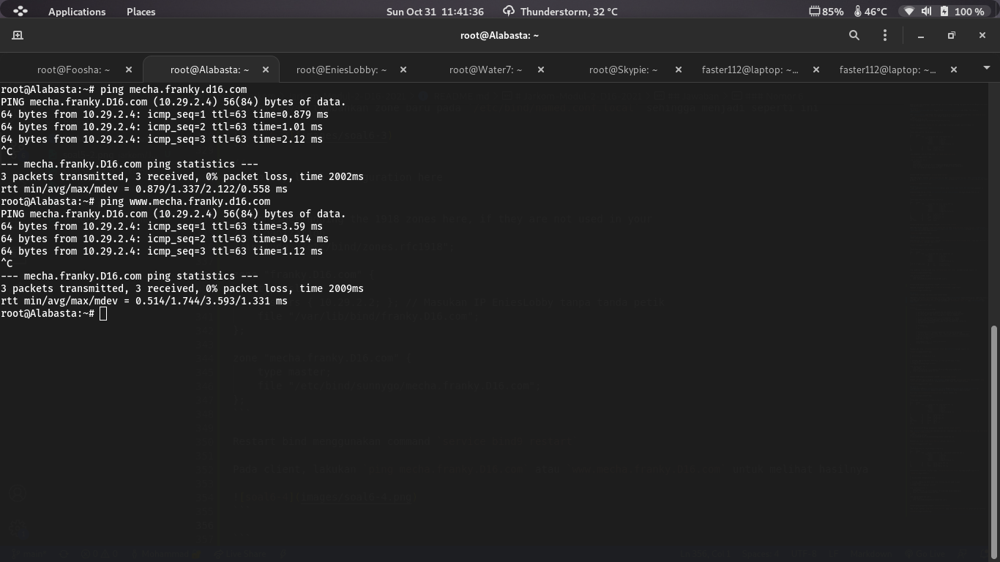

### Nomor 7
* Buatlah subdomain **general.mecha.franky.yyy.com** dengan alias **www.general.mecha.franky.yyy.com** yang mengarah ke **Skypie**

Pada **Water7**, edit file, `mecha.franky.D16.com` menjadi seperti ini

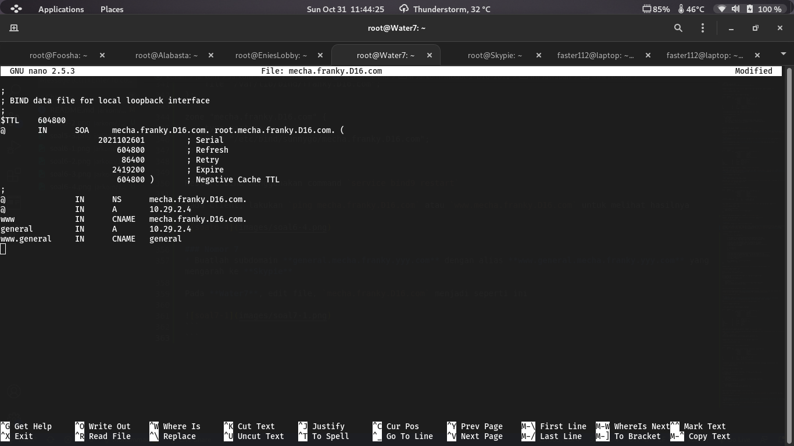
```
;
; BIND data file for local loopback interface
;
$TTL    604800
@       IN      SOA     mecha.franky.D16.com. root.mecha.franky.D16.com. (
                     2021102601         ; Serial
                         604800         ; Refresh
                          86400         ; Retry
                        2419200         ; Expire
                         604800 )       ; Negative Cache TTL
;
@               IN      NS      mecha.franky.D16.com.
@               IN      A       10.29.2.4
www             IN      CNAME   mecha.franky.D16.com.
general         IN      A       10.29.2.4
www.general     IN      CNAME   general
```

Restart bind menggunakan command `service bind9 restart`

Pada client, lakukan `ping general.mecha.franky.D16.com` atau `www.general.mecha.franky.D16.com` untuk melihat hasilnya

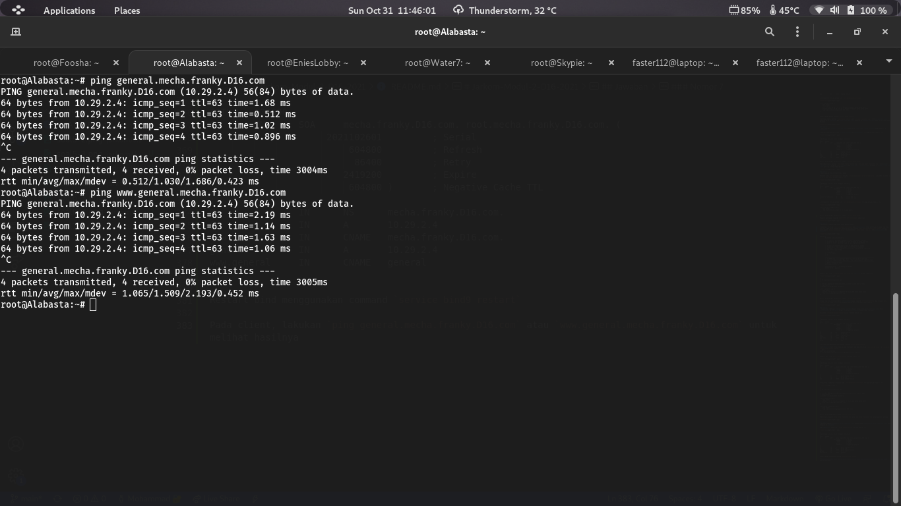

### Nomor 8
* Buat webserver **www.franky.yyy.com** dengan DocumentRoot pada `/var/www/franky.yyy.com`!

Pada **Water7**, download requirement file pada github, lalu ekstrak file tersebut. Copykan folder `franky` ke `/var/www/franky.D16.com`. Kemudian duplikat file `/etc/apache2/sites-available/000-default.conf` ke `/etc/apache2/sites-available/franky.D16.com.conf` lalu tambahkan beberapa baris file tersebut menjadi seperti ini

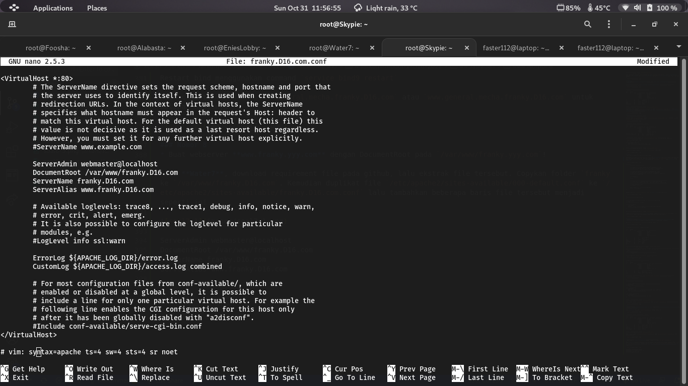
```
ServerAdmin webmaster@localhost
DocumentRoot /var/www/franky.D16.com
ServerName franky.D16.com
ServerAlias www.franky.D16.com
```

Enable configurasi tersebut dengan `a2ensite franky.D16.com` lalu restart apache2 dengan command `service apache2 restart`

Pada client masukkan command `lynx franky.D16.com` untuk melihat hasilnya

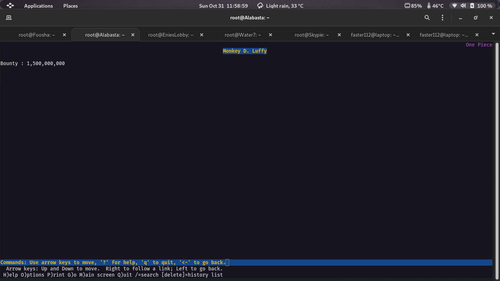

### Nomor 9
* Konfigurasikan sehingga url **www.franky.yyy.com/index.php/home** dapat menjadi menjadi **www.franky.yyy.com/home**

Tambahkan file `.htaccess` pada DocumentRoot (`/var/www/franky.D16.com`) lalu isikan file tersebut dengan ini

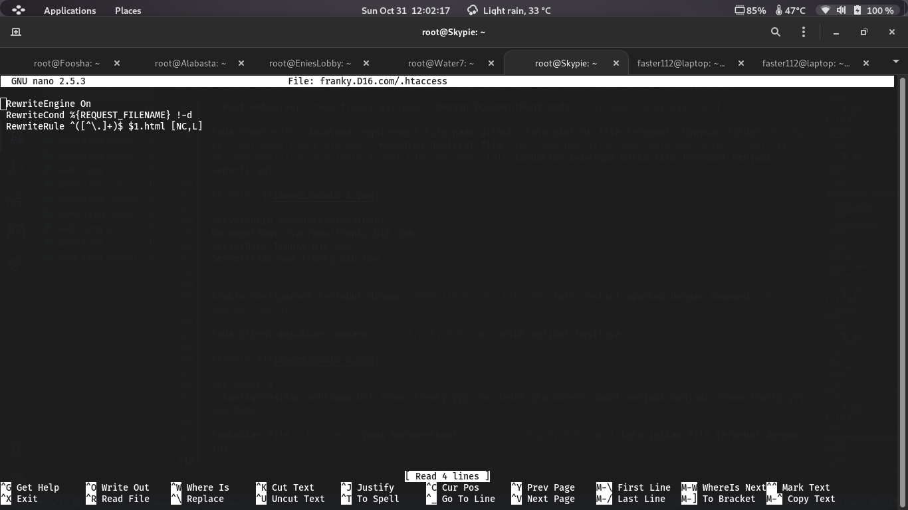
```
RewriteEngine On
RewriteCond %{REQUEST_FILENAME} !-d
RewriteRule ^([^\.]+)$ $1.html [NC,L]
```

Lalu tambahkan baris dibawah ini pada file `/etc/apache2/sites-available/franky.D16.com.conf`
```
<Directory /var/www/franky.D16.com>
    Options +FollowSymLinks -Multiviews
    AllowOverride All
</Directory>
```

Sehingga menjadi seperti ini


Restart apache2 dengan command `service apache2 restart`

Pada client, dapat lakukan `lynx franky.D16.com/home` untuk melihat hasilnya

### Nomor 10
* Buat subdomain **www.super.franky.yyy.com** menjadi penyimpanan aset yang memiliki DocumentRoot pada `/var/www/super.franky.yyy.com`

Copykan folder `super.franky` ke `/var/www/super.franky.D16.com` dan copykan file `/etc/apache2/sites-available/000-default.conf` ke `/etc/apache2/sites-available/super.franky.D16.com.conf` lalu edit file tersebut dengan menambahkan baris berikut
```
ServerAdmin webmaster@localhost
DocumentRoot /var/www/super.franky.D16.com
ServerName super.franky.D16.com
ServerAlias www.super.franky.D16.com
```

Restart apache2 dengan command `service apache2 restart`

Pada client, dapat lakukan `lynx super.franky.D16.com` untuk melihat hasilnya

### Nomor 11
* Buatlah agar pada folder `/public`, hanya dapat melakukan directory listing saja!

Edit file `/etc/apache2/sites-available/super.franky.D16.com.conf` dengan menambahkan beberapa baris seperti berikut
```
<Directory /var/www/super.franky.D16.com/public>
    Options +Indexes
</Directory>
```

Restart apache2 dengan command `service apache2 restart`

Pada client, dapat lakukan `lynx super.franky.D16.com` untuk melihat hasilnya

### Nomor 12
* Gunakan error file 404.html pada folder /error untuk mengganti error kode pada apache!

Masukkan command berikut
```bash
echo ErrorDocument 404 /error/404.html > /var/www/super.franky.D16.com/.htaccess
```

Kemudian tambahkan baris berikut pada file `/etc/apache2/sites-available/super.franky.D16.com.conf`
```
<Directory /var/www/super.franky.D16.com/error>
    Options -Indexes
</Directory>

<Directory /var/www/super.franky.D16.com>
    Options FollowSymLinks
    AllowOverride All
</Directory>
```

Restart apache2 dengan command `service apache2 restart`

Untuk mengecek apakah berhasil, masukkan command `lynx super.franky.D16.com/[kata_apapun]`

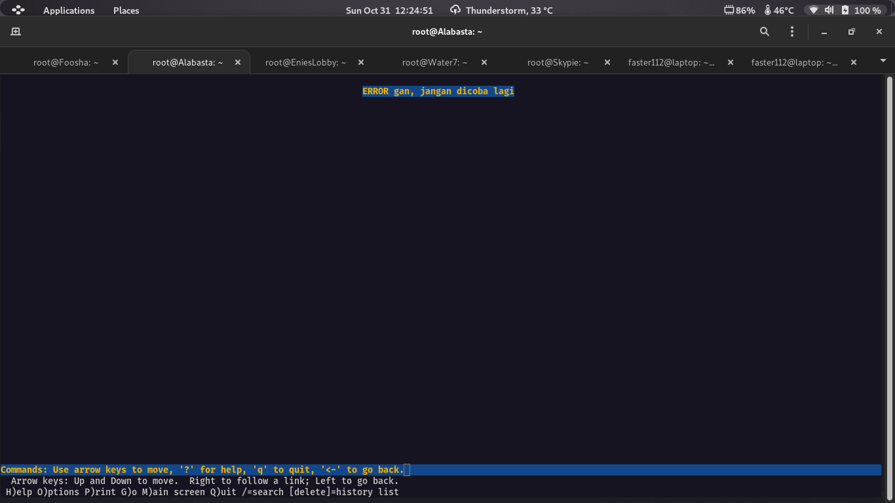

### Nomor 13
* Konfigurasikan file agar dapat mengakses file asset `www.super.franky.yyy.com/public/js` menjadi `www.super.franky.yyy.com/js`

Gunakanlah directory alias dengan menambahkan baris berikut pada file `/etc/apache2/sites-available/super.franky.D16.com.conf`
```
Alias "/js" "/var/www/super.franky.D16.com/public/js"
```

Sehingga hasil keseluruhan file seperti berikut

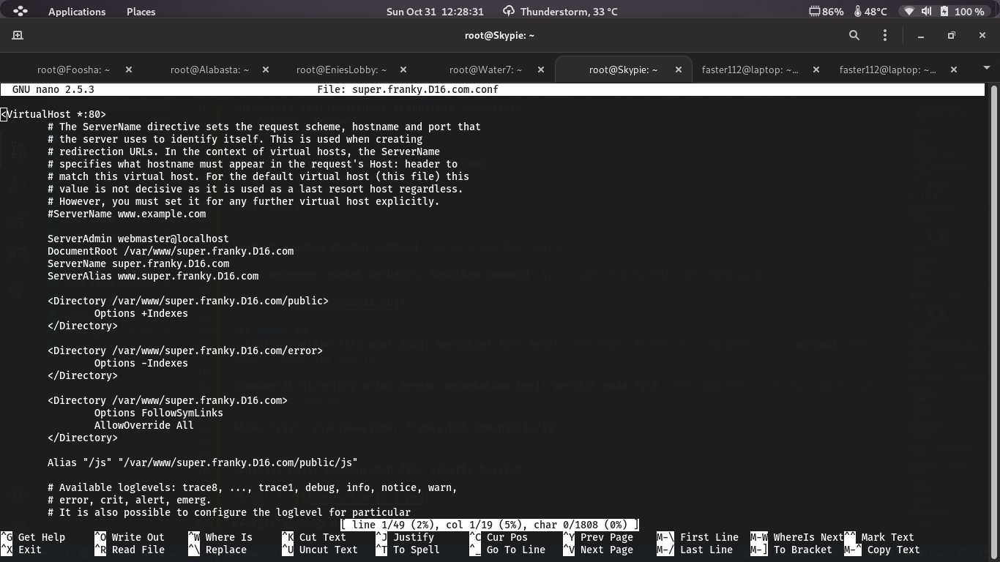

Restart apache2 dengan command `service apache2 restart`

Pada client, jalankan command `www.super.franky.yyy.com/js` untuk melihat hasilnya

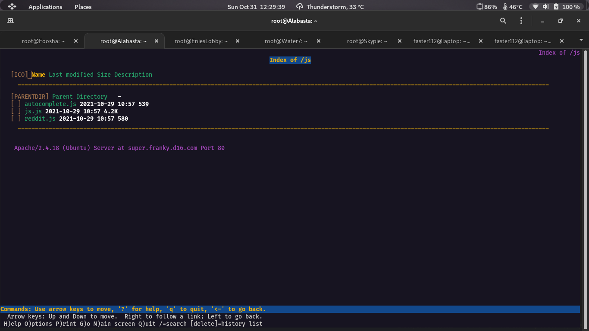